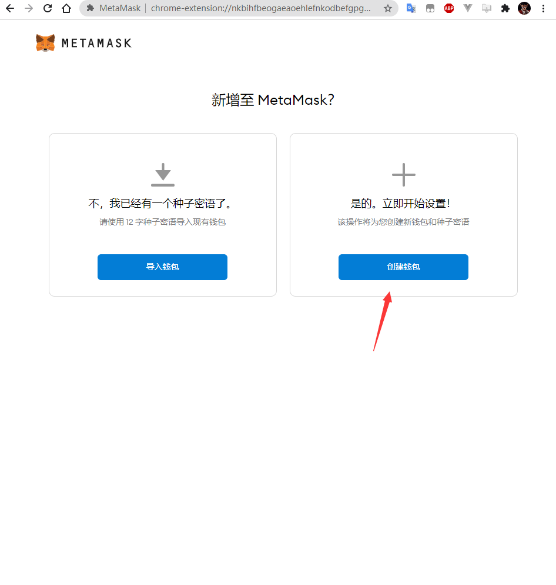
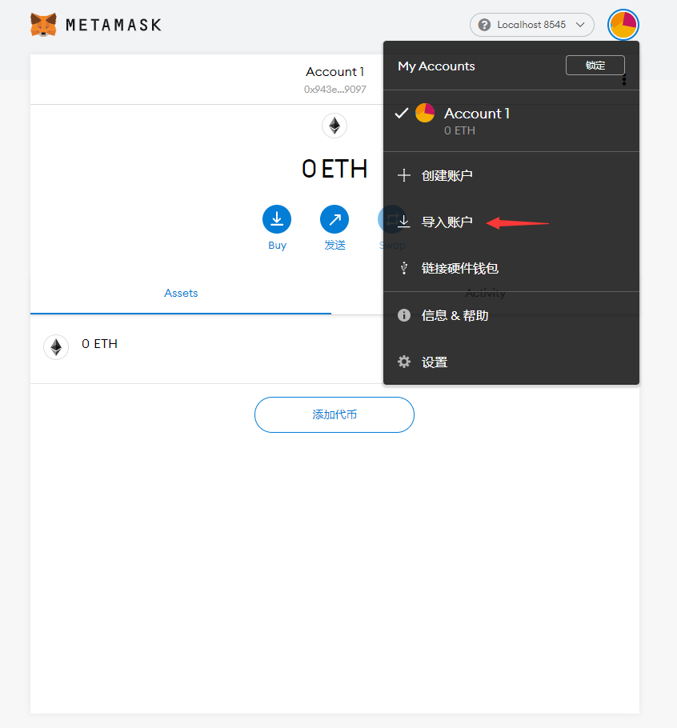
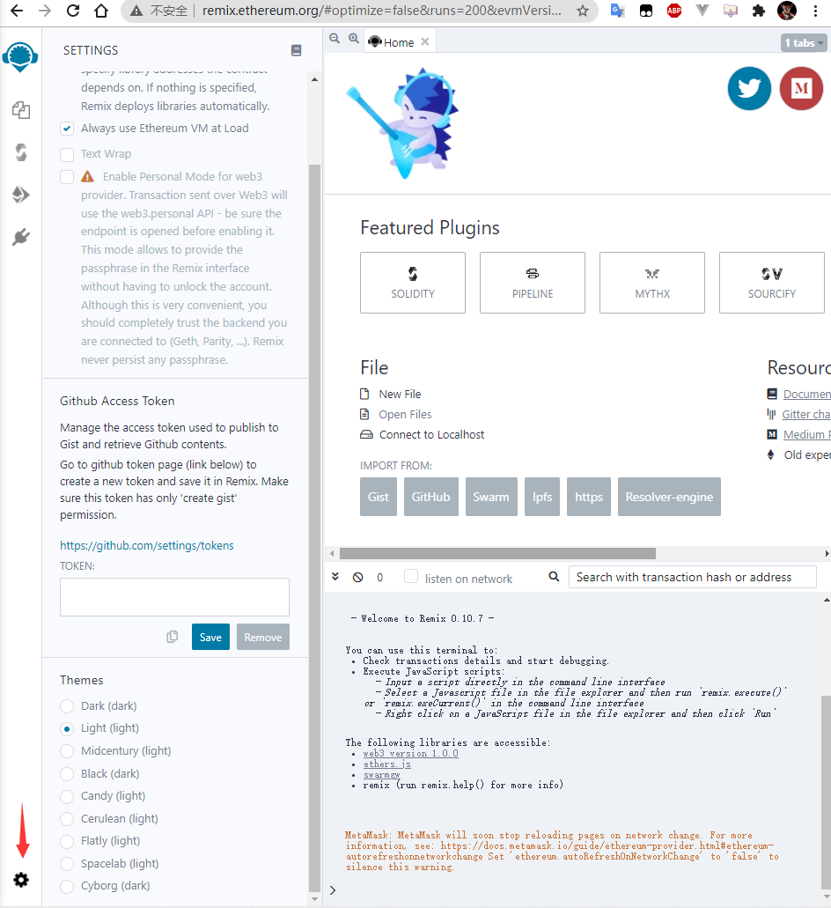
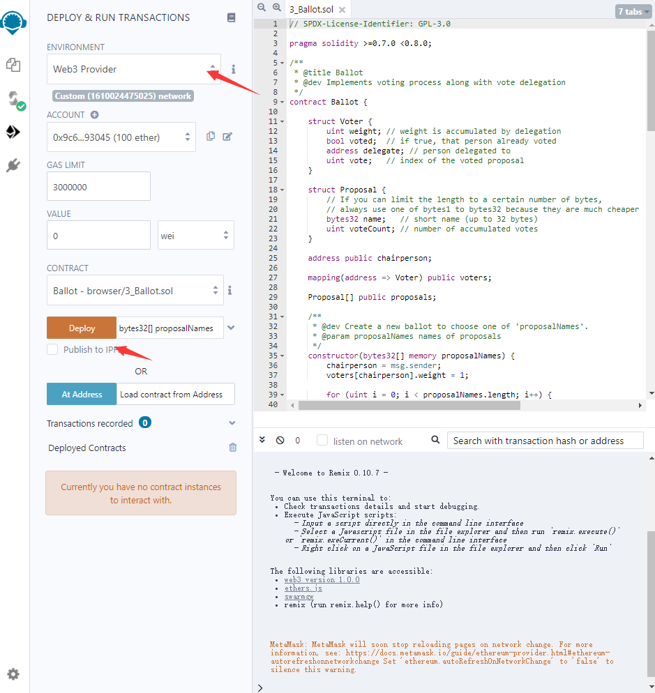

由于区块链与数字货币这门课程给的指导教程涉及的各种库的版本都比较旧，有的甚至连接口都已经变化，导致实际的开发过程中踩了很多的坑，特此编写此指南来对其中的开发环境配置进行说明。

## 项目依赖的开发工具

### Truffle 和 Ganache CLI

如果在本地环境下进行DApp的开发，那么我们就需要一个好用的本地环境来进行智能合约的部署，首先我们需要一个本地的ETH区块链环境，[Ganache CLI](https://github.com/trufflesuite/ganache-cli)是一个很好的选择。要将智能合约部署到Ganache CLI启动的区块链上，我们还需要一个工具来帮助我们进行智能合约的编译，这个工具就是[Truffle](https://github.com/trufflesuite/truffle)，它会把智能合约编译为一个JSON文件，其中包含ABI，bytecode等各种部署时需要的参数。

### Web3

为了便利Web端和区块链进行交互，我们需要一个JS API来实现这个功能，他就是[web3.js](https://github.com/ChainSafe/web3.js)，它提供了各种接口来实现和区块链以及智能合约的交互。

### Metamask

如果我们的Web端需要和特定的ETH账户交互，我们需要实现一系列复杂的功能，好在[Metamask](https://github.com/MetaMask/metamask-extension)帮我们处理好了这一切，我们只需要在Metamask中配置好自己的钱包以及私钥，然后在JS中对其进行调用就可以实现转账，扣款等功能。

### REMIX

当你的智能合约编写好之后，有很多方法都可以对它进行测试，但是笔者认为最便利的方法就是利用在线IDE [REMIX](http://remix.ethereum.org/)来对其进行调试，笔者本身对这种在线的IDE也不是很感冒，但是在尝试过REMIX之后，我彻底的改变了这种想法。笔者在开发的最开始阶段，坚定的通过code review和编写truffle测试脚本的方式来对写好的智能合约进行调试，这种方法不仅效率低，执行还慢，还容易出现一堆烦人的问题，在换到了REMIX之后，这些问题全都迎刃而解，REMIX可以直接跟本地的Ganache区块链进行交互，并通过可视化的方式对智能合约中的各种函数进行调用，总之就是非常的好用，推荐读者们试一试。

## 工具链的配置

在上述工具都妥善的安装好之后，我们就可以将他们配置成一个工具链了。按照以下的步骤逐步进行开发环境的部署，如果顺利的话，很快就可以拥有一个本地的，高效的ETH开发环境。

### 配置Ganache CLI

Ganache CLI可以通过默认的方式`ganache-cli`直接在终端中启动，但是由于Ganche是运行在内存中的，每次启动时Ganache中都是一个全新的区块链，会生成全新的账号，全新的钱包，这对于我们的开发调试来说非常的不方便。但是好在ganache-cli手动配置账号的私钥，`ganache-cli --account="<private-key>,<balance>"`就可以配置一个指定私钥和余额的账户，而且`--account`参数可以输入任意多次，那么我们就可以直接将ganache-cli启动时生成的私钥写死，这样就不用每次重启ganache都需要去metamask中修改配置了。一个启动脚本的例子如下所示

```zsh
#!/bin/bash
ganache-cli -h 127.0.0.1 -p 8545 \
--account="0x09d41b29574cb6b4200c4245321f1b7a618336b8bd0bb0580c9e074aa9c7858a,0x56BC75E2D63100000" \
--account="0x7cec80d21399baa0e1eff40ef3be1f3a55d4d369591111fb370562e55e346d2b,0x56BC75E2D63100000" \
--account="0xee97670fc3b192248c3bff2903aee96f05843428341d0e28da9e746b9802f09b,0x56BC75E2D63100000" \
--account="0xe7e130dc9d4d2905cd55a8bddb05eb21d5a371d7dfe75a63c444d6e657c301e9,0x56BC75E2D63100000" \
--account="0xf252aaf70394a5d477f97485472601ca3215b7c015ac5875a34b321e003179fb,0x56BC75E2D63100000" \
--account="0xd13464415601336377f4d146c527f37444ac5bff740b190fdb119c0629edf870,0x56BC75E2D63100000" \
--account="0x9c68cab31e45311979f1fd305e77d673a03a2c1389d8c6357603267110cb4bf2,0x56BC75E2D63100000" \
--account="0x7cba3617446f12057313d101d03e31736a56bd7b06c62d9d33e62816dc71c334,0x56BC75E2D63100000" \
--account="0x3ab22c3f21864b3538c11d1d6d2b6a200266c2d509ba307db260f8deaafb8a04,0x56BC75E2D63100000" \
--account="0x7a78a4dc8977da3647cce27a2cbe84c1b0012eaec6f56f170ae1a4dddd2f2b2e,0x56BC75E2D63100000"
```

上述配置会在127.0.0.1:8545启动一个区块链，并生成十个账号，每个账号的余额是100ETH，值得注意的是balance参数的值是一个十六进制数，它的单位是WEI。

### 配置Metamask

上述指定密钥生成区块链配置的方法会产生一个问题，那就是Ganache不再为我们生成钱包，所以我们就需要在Metamask中进行钱包的配置。



注意Metamask为钱包生成的密语一定要保存好，不然以后恢复不到测试的钱包账号了


之后会进入到Metamask的主界面，在右上角添加一个自定义RPC


自定义RPC的配置如下


点击保存之后Metamask就能连接到Ganache提供的RPC网络上了，现在你会发现默认的Account 1的余额是0ETH，这是因为这个账号不在Ganache区块链上，这时候我们将之前配置好的十个账号私钥中随便挑一个添加到Ganche中就大功告成了。




### 配置REMIX

配置了一大堆之后我们终于可以进行智能合约的部署和测试了，现在我们打开[REMIX](http://remix.ethereum.org/)，首先进行~~最重要的配置~~给Remix挑选一款喜欢的主题



然后再Remix中新建一个文件，把写好的智能合约粘贴进去，之后先点击编译


然后在部署界面将ENVIRONMENT选项配置为Web3 Provider也就是本地的Ganche CLI启动的RPC网络，然后点击Deploy就能将合约部署到Ganache CLI上了。



### Web3与智能合约的交互

Web3的文档中明确的定义了Web3的各种交互行为，这里说以下如何获取Metamask注入到浏览器中的Web3 Provider以及如何获取Metamask授权的账号

```js
let getWeb3 = async function () {
  var provider
  var address
  if(window.ethereum) {
    provider = window.ethereum
    try {
      await window.ethereum.enable()
    } catch (error) {
      console.error("User denied account access")
    }
    var web3 = new Web3(provider)

    await web3.eth.getAccounts(function (error, result) {
        if (!error) {
            address = result
        }
    })

    return new Array(web3, address[0])
  }
  else {
    alert("ERROR! metamask not installed!")
  }
}
```

一个获取Metamask注入Provider的函数就如同上面的代码所示`window.ethereum`就是Metamask注入的web3 provider，`window.ethereum.enable()`这个调用会启动Metamask的认证流程，当认证通过之后，就能获取到授权账号的地址了。
