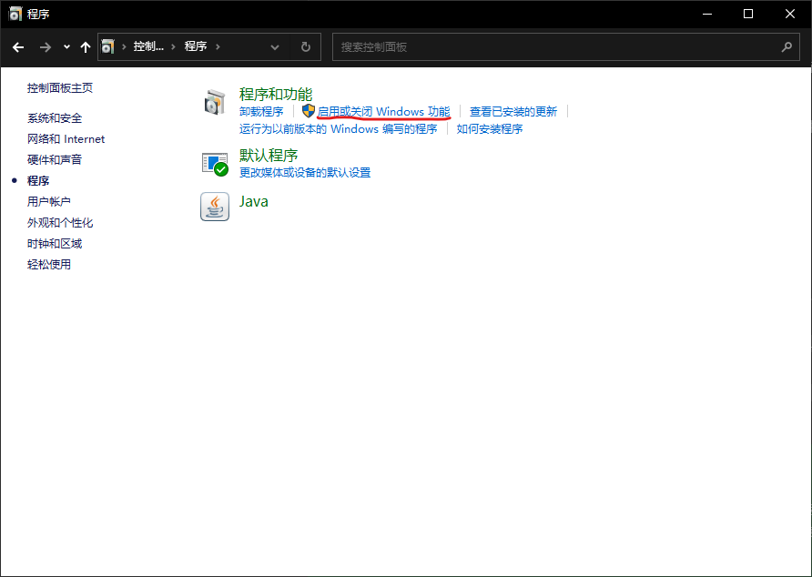
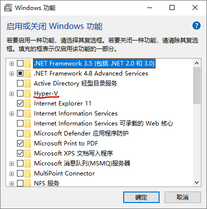
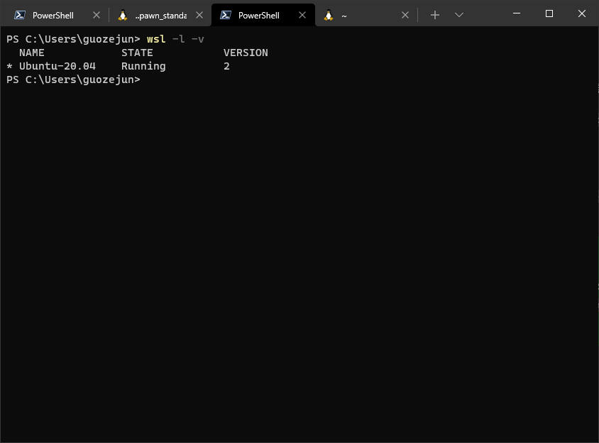
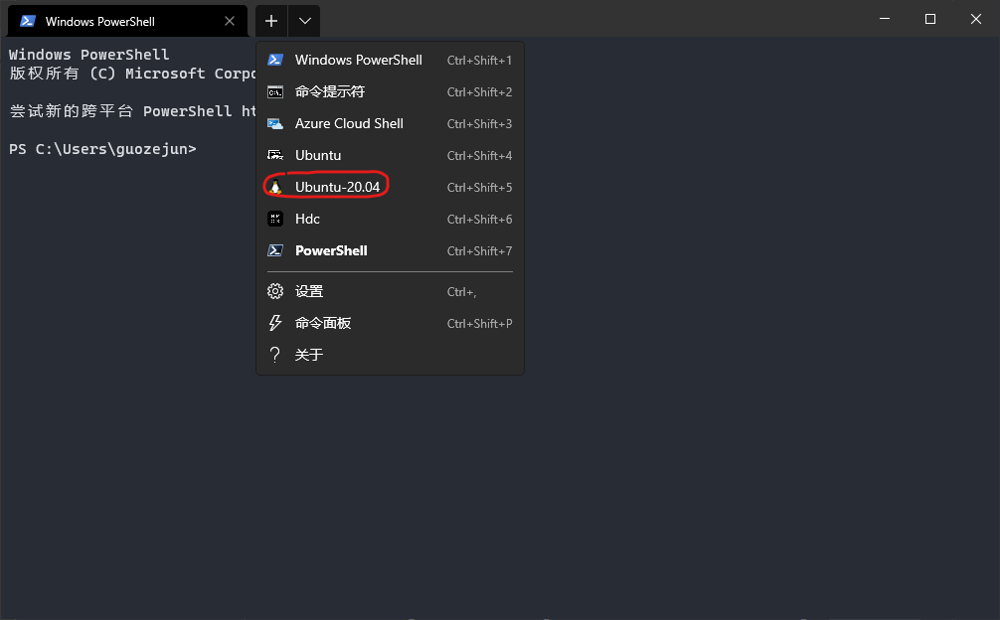
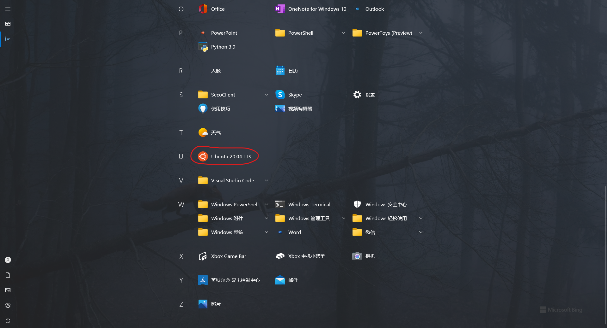
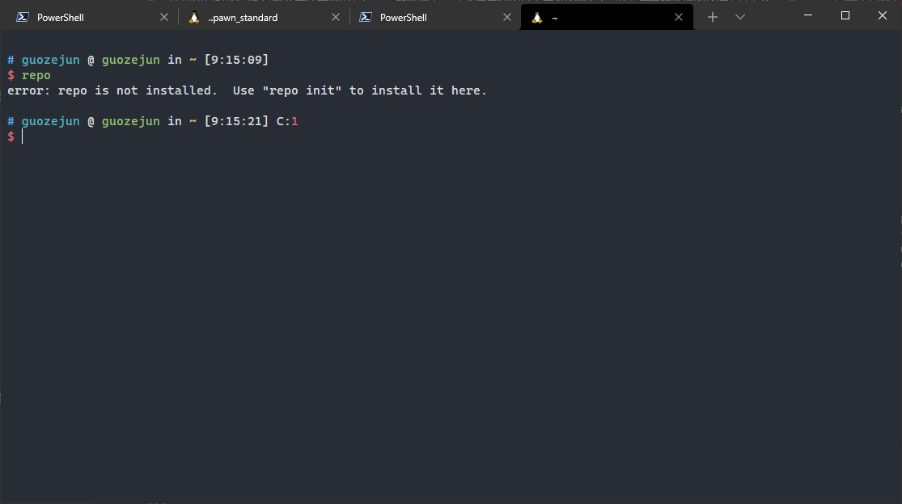
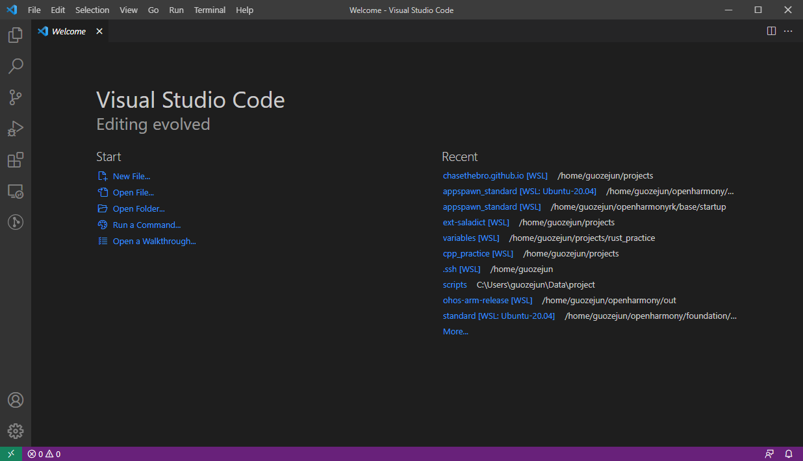
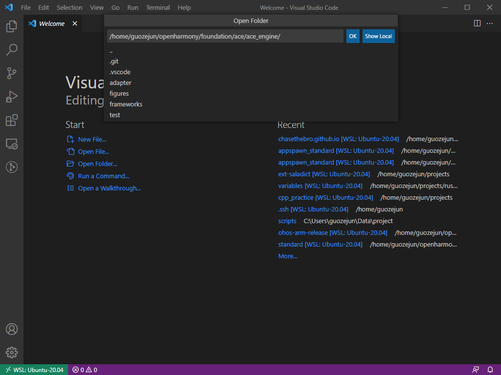
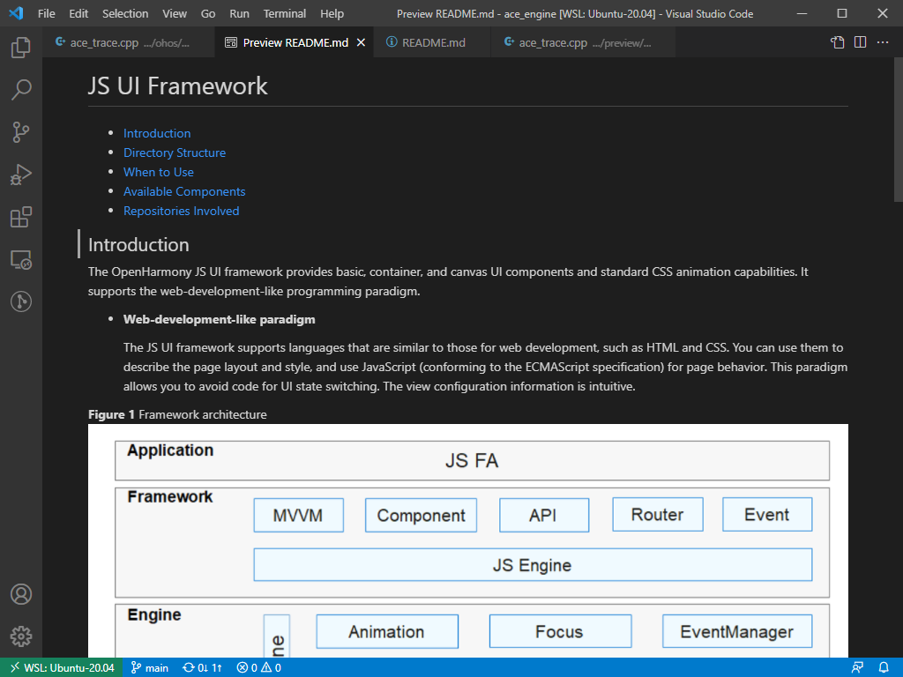
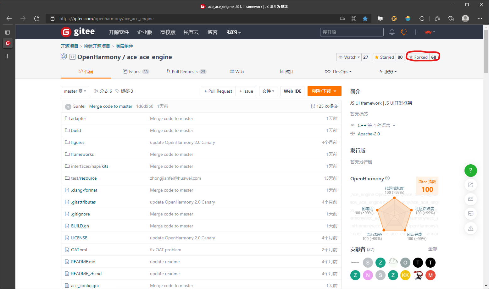

## 概述

目前OpenHarmony支持的L2设备主要是Hi3861、Hi3516、Hi3518这三种单板，三种设备的驱动目前都只支持Windows设备，所以如果代码开发涉及到烧写单板镜像就需要选择一个Windows开发设备。OpenHarmony的工具链包含repo、ninja、gn、pyhton，这些工具的配置在Linux开发设备上比较容易配置。如果在Windows设备上使用虚拟机，那么Linux系统只能通过软件指令集和硬件交互，效率比较低。所以比较好的实践是将开发环境部署在Linux服务器上，或者使用微软最近力推的WSL2。由于远程服务器的搭建方法在OpenHarmony官网上已经有比较详细的描述，本文将着力介绍如何使用WSL2搭建OpenHarmony开发环境。

<!-- more -->

## WSL2安装

WSL2的安装详情见[微软官网](https://docs.microsoft.com/zh-cn/windows/wsl/install)。Linux发行版推荐使用Ubuntu20.04LTS，下文的介绍也将基于这个发行版进行。

### WSL2 Windows环境准备

打开控制面板，启动hyper-v功能，勾选hyper-v功能之后退出并重启PC。





以管理员权限打开PowerShell，执行以下命令，期间可能需要重启PC。

```shell
wsl --install
```

### 安装WSL Linux发行版

以管理员权限打开PowerShell

```shell
wsl --set-default-version 2
wsl --install -d Ubuntu-20.04
```

安装完成之后，执行以下命令，如果结果如下图所示，则WSL环境已经准备完成。

```shell
wsl -l -v
```



## 下载Windows Terminal（可选）

如果不想安装Windows Terminal，可以直接跳到下一个Chapter获取OpenHarmony的代码。

点击[Windows Terminal](https://www.microsoft.com/en-us/p/windows-terminal/9n0dx20hk701?activetab=pivot:overviewtab)的链接，在微软商店中直接进行下载，或者在Windows Terminal的[Github Release](https://github.com/microsoft/terminal/releases)页面中选择适合的版本下载。

## OpenHarmony代码获取

启动WSL，之后的操作都在WSL中执行。可以在Windows Terminal中打开WSL或者直接启动WSL终端。




### 安装依赖

```shell
sudo apt-get update && sudo apt-get install gnutls-bin build-essential fakeroot dpkg-dev git-lfs build-essential gcc g++ make zlib* zip xsltproc x11proto-core-dev wget vim unzip u-boot-tools tzdata texinfo ssh scons python3-minimal python3-setuptools python3-pip python3-distutils python3-apt python3.8-distutils npm nfs-kernel-server mtools mtd-utils m4 locales libxml2-utils libx11-dev libreadline-dev libgl1-mesa-dev libffi* libc6-dev-x32 libc6-dev-i386 lib32z-dev lib32ncurses5-dev gperf gnupg git-lfs git-core g++-multilib g++ flex dosfstools default-jre default-jdk curl ccache build-essential bison binutils bc genext2fs ruby
```

### 安装工具

检查一下$HOME路径下是否有bin目录，如果没有的话创建一个bin目录，并将bin目录添加到`$PATH`变量中。

```shell
if [ ! -d "$HOME/bin" ]; then mkdir $HOME/bin; else echo "$HOME/bin exist"; fi
PATH=$HOME/bin:$PATH
```

安装repo

```shell
curl -s https://gitee.com/oschina/repo/raw/fork_flow/repo-py3 > repo
mv repo ~/bin
chmod +x ~/bin/repo
```

执行完上述操作之后，执行一下repo指令，如果如下图所示，说明已经安装成功，可以执行之后的操作。



如果报错python未找到，建立软连接指向python3。如果报错repo指令未找到，检查`~/bin`是否在PATH环境变量中。

### 创建代码目录拉取代码

```shell
mkdir $YOUR_OPENHARMONY_DIR
cd $YOUR_OPENHARMONY_DIR
repo init -u https://gitee.com/openharmony/manifest.git -b OpenHarmony-3.0-LTS --no-repo-verify
repo sync -c
repo forall -c 'git lfs pull'
```

### 下载预编译工具

```shell
./build/prebuilts_download.sh
```

## IDE配置

OpenHarmony的IDE配置与其他的远程开发配置无异，本文选取[VSCode](https://code.visualstudio.com/)配置方法进行介绍。

### 插件安装

使用微软官方开发的[Remote-WSL](https://marketplace.visualstudio.com/items?itemName=ms-vscode-remote.remote-wsl)插件能够让Windows本地的VSCode直接编辑WSL目录下的文件，并使用WSL环境下的开发环境使用IntelliSense进行语法错误的校验和智能代码补全。

### 编辑代码仓

#### 打开一个新的VSCode窗口



#### 打开远端代码库

在新窗口中，按F1呼出VSCode命令窗口，输入`Remote-WSL`,选择`Remote-WSL：New WSL Window`，此时会弹出一个新窗口，在其中按`Ctrl + K Ctrl + O`，此时会弹出一个打开Folder的选项。我们以OpenHarmony子系统ace_engine为例，输入子系统目录的绝对路径，点击回车，此时我们就打开了对应的子系统代码。






## 贡献代码

注意，在本地创建Commits的时候，要在Commit信息中包含[Signed-off-by](https://gitee.com/openharmony/docs/blob/master/zh-cn/contribute/FAQ.md)信息。

我们在本地对OpenHarmony代码进行修改之后想要贡献到开源社区应该如何操作呢。作为开发者，一般不具备直接OpenHarmony代码仓提交代码的权限，一般都会采用fork & pull request模型向OpenHarmony代码仓进行提交，接下来将以ace_engine子系统为例对具体的流程进行介绍。

### Fork代码仓

首先建立[ace_engine](https://gitee.com/openharmony/ace_ace_engine)的fork仓。



### 将修改推送到Fork代码仓

1. 添加Fork代码仓的推送地址，`git remote add fork $YOUR_FORK_ADDRESS`
2. 推送代码到Fork代码仓，`git push fork HEAD:$YOUR_BRANCH`

### 创建PR

1. 签署[OpenHarmoony DCO](https://dco.openharmony.io/sign/Z2l0ZWUlMkZvcGVuX2hhcm1vbnk=)
2. 创建PR并在PR中评论start build触发门禁构建
3. 等待PR被committer合入

## 参考资料
> - [Windows Subsystem for Linux Documentation](https://docs.microsoft.com/en-us/windows/wsl/)
> - [OpenHarmony](https://www.openharmony.cn/)
