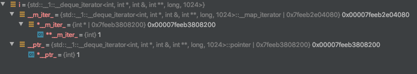
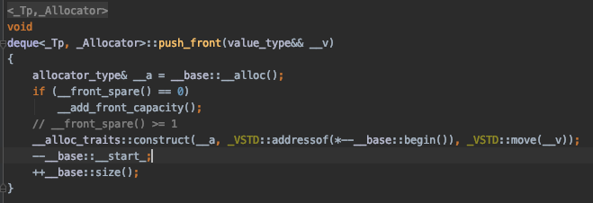

## 起因

在LeetCode上做题的时候遇到一道需要手动实现deque的题目，因为需要通过一个哈希表经过O(1)的时间来访问到deque中的每个节点。于是机智的我想到了通过iterator来访问节点的方法，但是出乎意料的是出现了内存访问问题。最后定位到问题出在通过哈希表中储存的iterator来访问内存中的内容时，指针已经失效了。

## 示例

实际出问题的代码段比较复杂，下面是它的逻辑简化版本

```cpp
deque<int> dq {1, 2, 3};
auto i = dq.begin();
dq.push_front(4);
dq.erase(i);
cout << dq.front() << endl;
```

## 原理剖析

当调用`dq.erase(i)`之后，程序发生了非法内存访问，debug过程中发现，当`dq.push_front(4)`之后，iterator就已经失效了，那么这是怎么发生的呢，首先我查询了deque在插入元素时的原理。

> deque的空间由一段一段的定量连续空间构成，deque采用一块map作为主控，这个map是一块连续空间，其中每个元素都是指针，指向另一段较大的连续空间，称为缓冲区。
>
> 

迭代器中需要四个指针，当前元素的指针，当前元素所在的缓冲区的起始指针，当前元素所在缓冲区的尾指针，指向map中指向所在缓冲区的指针，迭代器的结构如下图所示。



接下来看STL中对于push_front()函数的具体实现



接下来我们通过一段代码来分析，push_front(4)之后发生了什么

```cpp
cout << dq.__capacity() << endl;
cout << dq.__block_count() << endl;
dq.push_front(4);
cout << dq.__capacity() << endl;
cout << dq.__block_count() << endl;

/*
输出：
1023
1
2047
2
*/

auto i = dq.begin();
auto j = dq.end() - 1;
auto k = dq.end() - 3;
cout << "4和3在内存中的距离" << (&*i - &*j) << endl;
cout << "3和1在内存中的距离" << (&*j -&*k) << endl;

/*
输出：
4和3在内存中的距离3069
3和1在内存中的距离2
*/
```

可以看出，在push_front(4)之后，deque直接又开辟了一片缓冲区，将4单独的放在了一个缓冲区上，而1，2，3则被放在了另一个缓冲区上。所以说之前指向1的迭代器因为缓冲区发生了变换，之前放置1的缓冲区已经失效，所以在此使用这个迭代器访问1就会出现内存访问错误。

## vector类型的迭代器失效问题

vector类型的容器在插入元素之后所需内存空间大于系统分配的内容空间空间的情况下，请求一块更大的连续内存空间，并将容器中已有的元素复制到新的内存空间中，那么在插入操作之前赋值的vector类型迭代器指向的内存空间就已经失效了。此时再用这个迭代器去访问和操作数据，就可能出现各种问题。

```cpp
vector<int> v1(10000, 0);
auto iter1 = v1.begin();
v1.push_back(1);
v1.emplace(v1.begin(), 1);
cout << *iter1 << endl;
cout << v1[0] << endl;

/*
输出：
0
1
*/
```


## 总结

迭代器失效，本质上就是指针指向的内存空间上原本存在的数据已经发生了变化。这个事情提醒了我不要想当然的去对STL容器的底层做猜测假设，一定要对它的具体实现方法深入的了解。

## 参考资料
> - [STL源码剖析——deque的实现原理和使用方法详解](https://blog.csdn.net/baidu_28312631/article/details/48000123)
> - [std::deque::deque](std::[deque](http://www.cplusplus.com/reference/deque/deque/)::deque)

